<div align="center">


# RemoteX

**Fast, secure and modern remote desktop for Windows.**<br/>
Share a Device ID and a temporary password, approve the request, and control the PC — with an end-to-end encrypted
session and an input pipeline engineered for responsiveness.

[](Cargo.toml)
[](apps/desktop/src-tauri/tauri.conf.json)
[](apps/desktop/package.json)
[](apps/desktop/package.json)
[](#known-limitations)
[](LICENSE)

<br/>

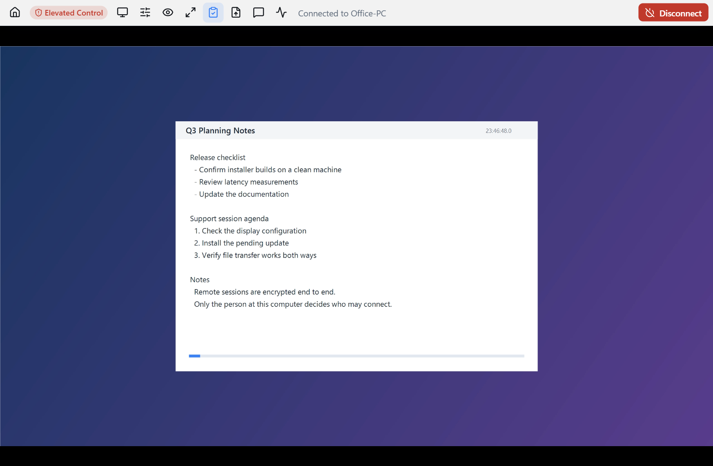

</div>

<br/>

RemoteX is a Windows remote-desktop application written in Rust with a Tauri 2 shell and a React/TypeScript
interface. The performance-sensitive parts — screen capture, video encoding, input injection, the encrypted session
protocol and the relay server — are native Rust. The UI is a thin, fast web front end that decodes video with
hardware-accelerated WebCodecs and never handles session secrets.

> **Project status.** RemoteX is working software with its own backend, installers and an automated test suite.
> It has **not** had an independent security audit and the installers are **unsigned** development builds.
> See [Known limitations](#known-limitations) and [docs/SECURITY.md](docs/SECURITY.md).

---

## Contents

[Features](#features) · [Why RemoteX](#why-remotex) · [How it works](#how-it-works) · [Screenshots](#screenshots) ·
[Architecture](#architecture) · [Tech stack](#tech-stack) · [Performance](#performance) ·
[Low-latency design](#low-latency-design) · [Security](#security) · [Elevated Control](#elevated-control) ·
[Privacy](#privacy) · [Quick start](#quick-start) · [Development](#development) · [Building](#building) ·
[Server](#server) · [Testing](#testing) · [Known limitations](#known-limitations) · [Roadmap](#roadmap) ·
[Contributing](#contributing) · [License](#license)

---

## Features

### Remote control
- **Desktop streaming** from native Windows capture (DXGI Desktop Duplication) through hardware-accelerated H.264
  (H.265 where the GPU and WebView support it), decoded on the viewer with WebCodecs.
- **Mouse, wheel and keyboard** control. Keys travel as physical scancodes, so the host's own layout (English,
  Arabic, …) produces the right character; a Unicode fallback covers IME and characters with no key.
- **Multi-monitor** detection with switching during a session, fit / original / stretch view modes and fullscreen.
- **Adaptive quality** driven by measured send delay, dropped frames and round-trip time, with presets
  (Auto, Best quality, Balanced, Low latency, Low bandwidth) and manual FPS / bitrate / resolution / codec controls.
- **Local cursor prediction** (Auto / On / Off) that hides round-trip delay on slow links.

### Connectivity
- **Device IDs and temporary passwords** — a stable 9-digit ID per installation and a rotating 6-character password.
- **Direct LAN connection** when both peers share a network, otherwise an **encrypted relay** through the RemoteX
  server. The relay carries ciphertext only.
- **Automatic connection and reconnect** with exponential backoff; a dropped session can resume without a new prompt.

### Security and consent
- Password-authenticated key exchange (SPAKE2) and an authenticated, replay-proof encrypted channel between peers.
- **Certificate-pinned** TLS to the RemoteX infrastructure.
- **Explicit host consent** for every session, with **per-session permissions** (view, mouse, keyboard, clipboard,
  file transfer) that the host can change or revoke live.
- Optional **unattended access** (off by default) with trusted-device lists.
- **Elevated Control** — opt-in administrator/UAC-prompt interaction through a Windows service, granted per session.

### Productivity
- **Clipboard synchronisation** for text and images, loop-free and permission-gated.
- **File transfer** — drag-and-drop upload, remote file browser download, resumable, SHA-256 verified,
  paced so it does not degrade live control.
- **Recent connections**, trusted devices and an address book.
- **Session chat** and a **connection-information panel** with measured RTT, jitter, FPS, bitrate, codec, encoder,
  capture/encode/decode/render times and input-latency diagnostics.

### Windows integration
- System tray, start with Windows, native notifications, crash dialog and structured logs.
- Light, dark and system themes.
- NSIS and MSI installers; the installers also install the elevated-control service.

### Internationalisation

| Language | Direction |
| --- | --- |
| English | LTR |
| العربية (Arabic) | RTL — the layout mirrors automatically |

Every string exists in both languages; the test suite enforces parity.

---

## Why RemoteX

- **Native where it matters.** Capture, encoding, input, cryptography and networking are Rust, not a JavaScript
  runtime. The web layer only renders UI and decodes video on the GPU.
- **Security-conscious by default.** Sessions are end-to-end encrypted, hosts consent explicitly, permissions are
  per session, and infrastructure trust is pinned inside the native client rather than configured by users.
- **Nothing to configure.** Install, open, share an ID and password. Users never enter server addresses,
  ports or fingerprints.
- **Latency is a design constraint, not an afterthought.** Input has its own priority path with bounded queues,
  stale mouse movement is coalesced and stale video is dropped ([details](#low-latency-design)).
- **Honest engineering.** Limitations are documented, unimplemented features are absent from the UI rather than
  faked, and performance numbers below state how they were measured.

---

## How it works

1. **Install RemoteX** on both computers and open it.
2. On the computer you want to reach, note the **Device ID** and **temporary password** on the home screen.
3. On the controlling computer, enter the ID and password, choose *Standard Control* or *Full / Elevated Control*,
   and click **Connect**.
4. The host reviews the request — who is asking, from where, and which permissions — and **accepts or rejects** it.
5. The remote desktop appears. The host sees a banner for as long as the session is active and can end it at any time.
6. When the session ends, the temporary password rotates.

---

## Screenshots

All screenshots are captured from the running application (English interface, throw-away test identities).

<p align="center">
  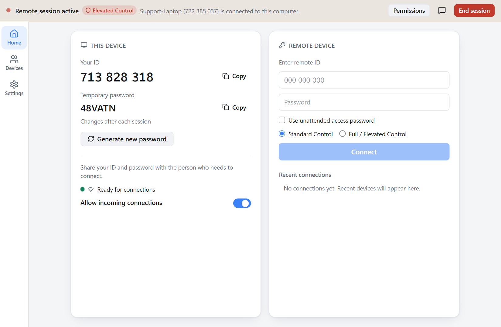
  <br/><sub><b>Home</b> — this device's ID and temporary password on the left, connect to a remote device on the right.</sub>
</p>

<table>
  <tr>
    <td align="center" width="50%">
      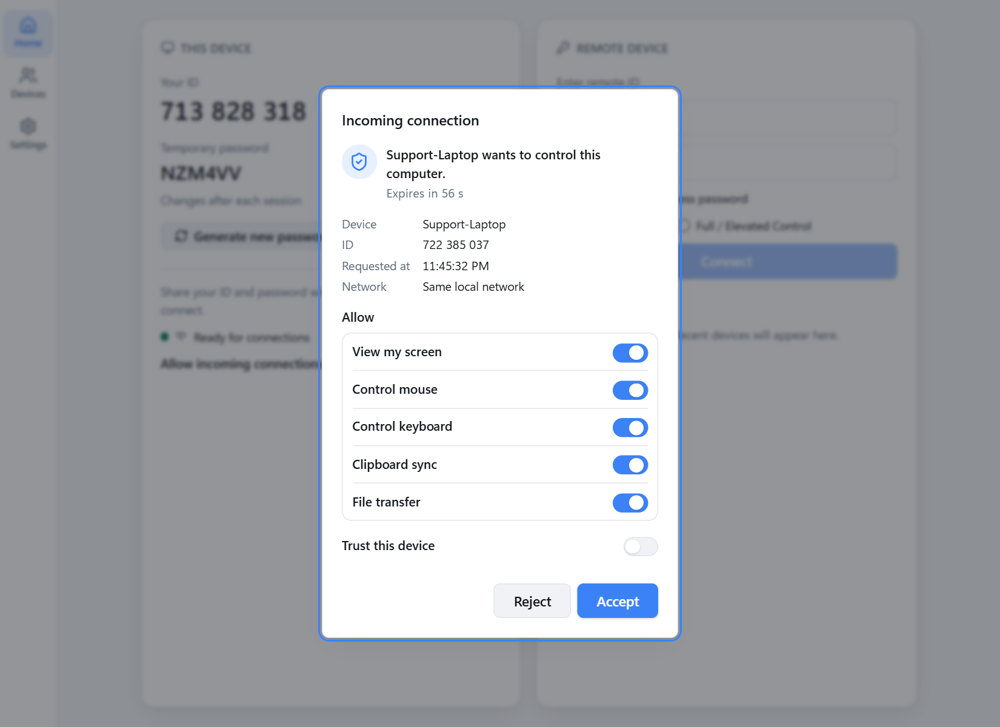<br/>
      <sub><b>Incoming request</b> — the host chooses exactly what to allow.</sub>
    </td>
    <td align="center" width="50%">
      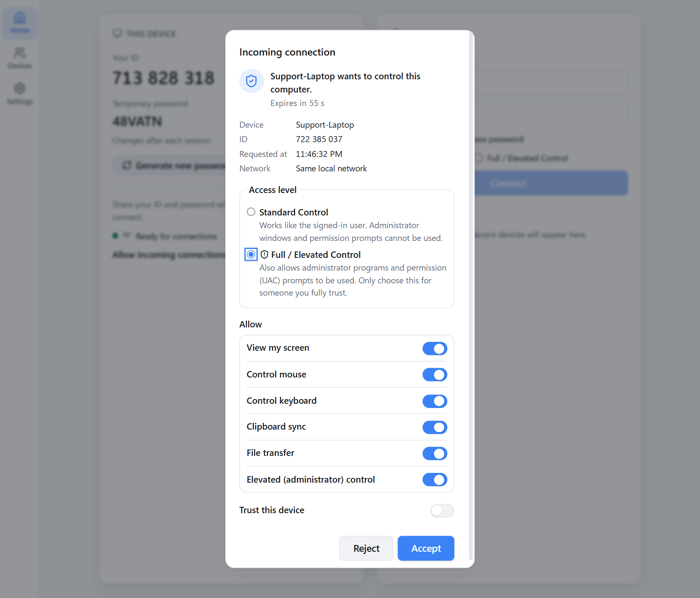<br/>
      <sub><b>Access level</b> — elevated control is never pre-selected.</sub>
    </td>
  </tr>
  <tr>
    <td align="center">
      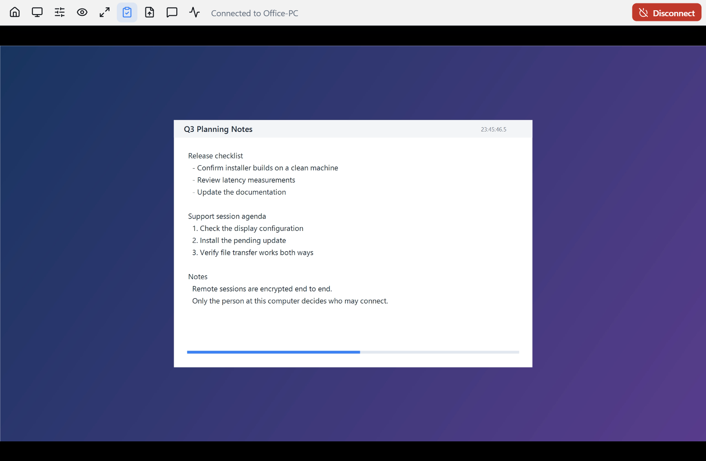<br/>
      <sub><b>Remote session</b> — toolbar for display, quality, view, clipboard, files, chat and diagnostics.</sub>
    </td>
    <td align="center">
      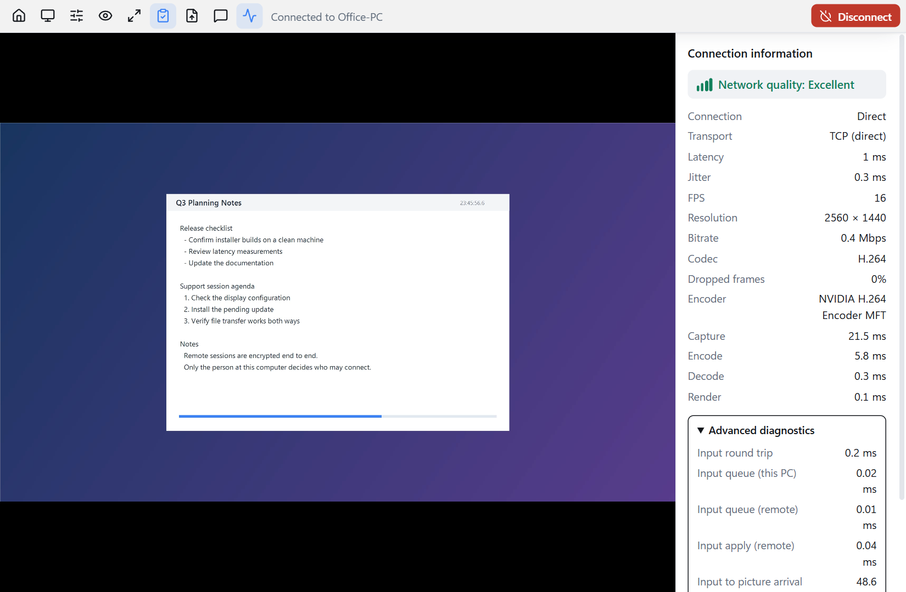<br/>
      <sub><b>Diagnostics</b> — measured latency, encoder, frame times and input queues.</sub>
    </td>
  </tr>
  <tr>
    <td align="center">
      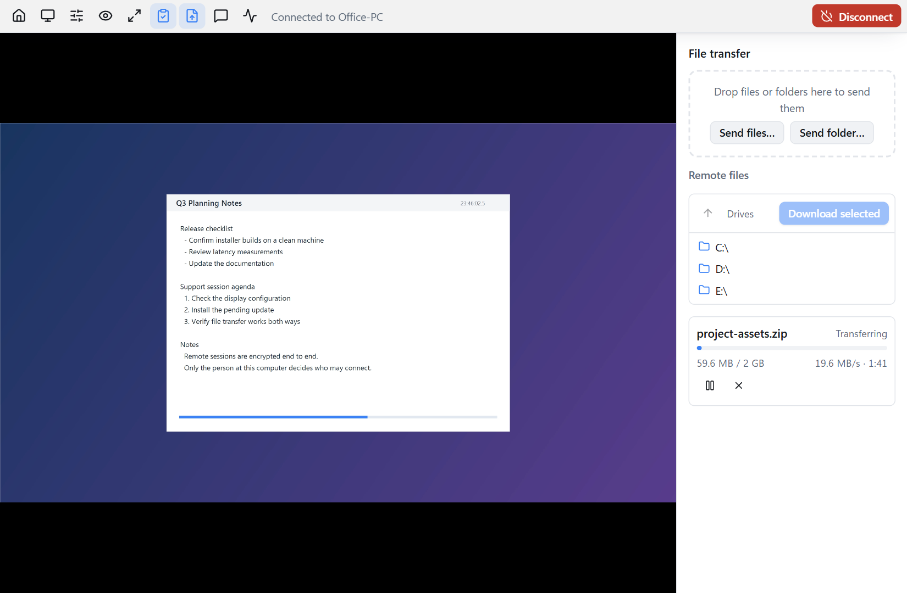<br/>
      <sub><b>File transfer</b> — progress, speed and ETA; paced to protect live control.</sub>
    </td>
    <td align="center">
      <br/>
      <sub><b>Host banner</b> — an always-visible indicator, including elevated control.</sub>
    </td>
  </tr>
  <tr>
    <td align="center">
      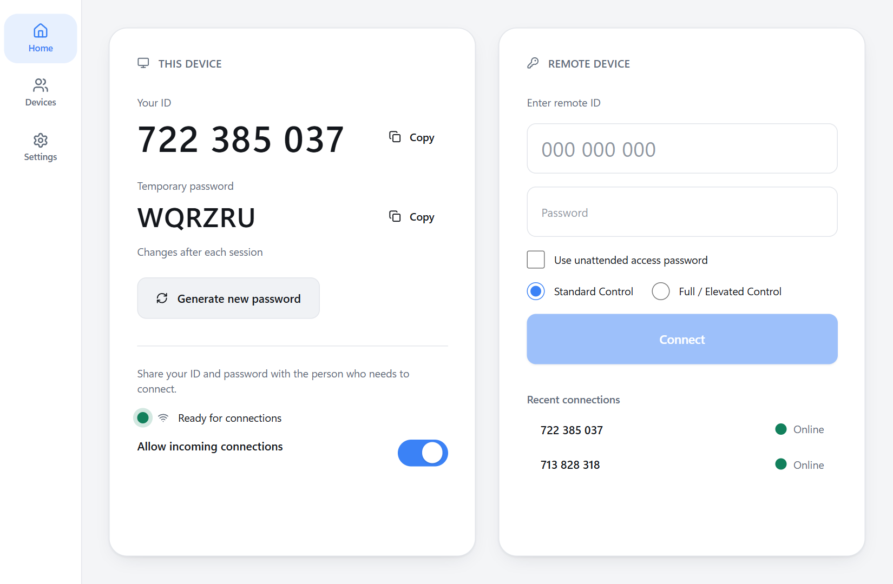<br/>
      <sub><b>Recent connections</b> with live presence.</sub>
    </td>
    <td align="center">
      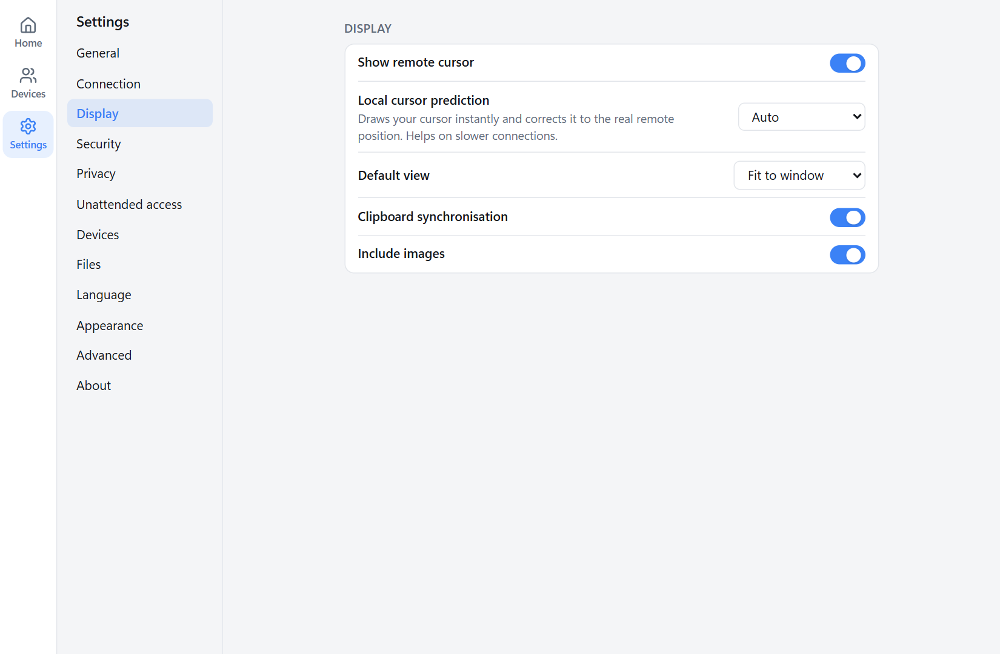<br/>
      <sub><b>Settings</b> — connection, display, security, privacy, files, language and more.</sub>
    </td>
  </tr>
  <tr>
    <td align="center">
      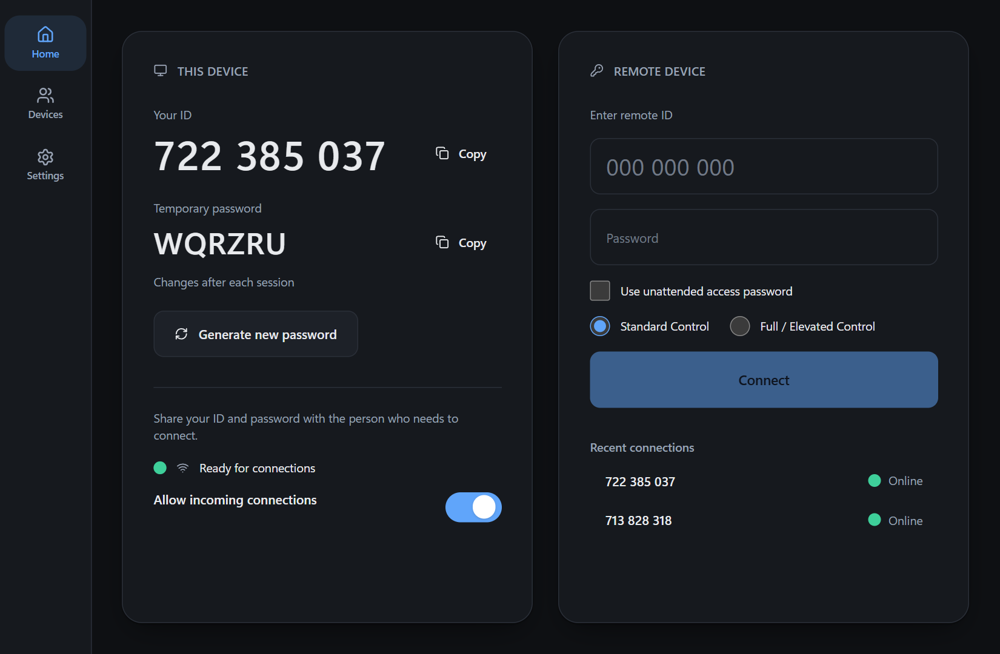<br/>
      <sub><b>Dark theme</b></sub>
    </td>
    <td align="center">
      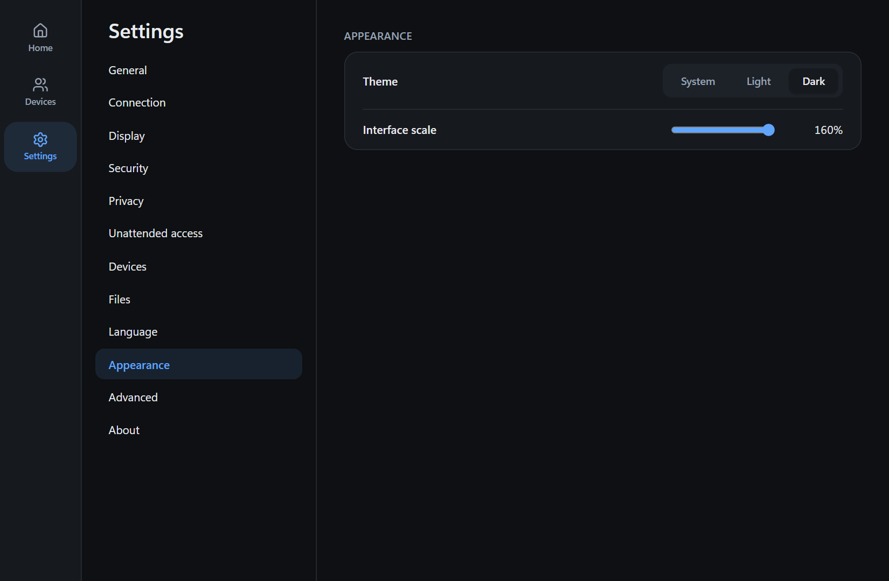<br/>
      <sub><b>Dark theme</b> — quality and connection settings.</sub>
    </td>
  </tr>
</table>

> The remote desktop shown in the session screenshots is a sample document window on a test machine. Both RemoteX
> instances ran on one computer over a direct local connection, so latency figures in those screenshots are not
> representative of Internet use — see [Performance](#performance).

---

## Architecture

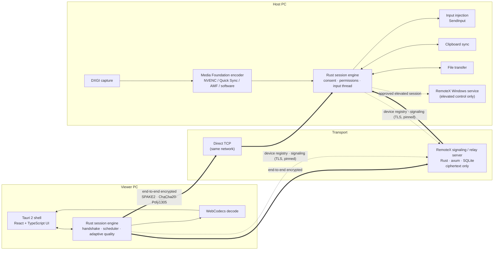

- **Signaling and relay.** Each client keeps a pinned-TLS WebSocket to the RemoteX server for registration,
  presence and session setup. When peers cannot connect directly, session frames are relayed through the same
  connection as opaque ciphertext.
- **One encrypted stream, three lanes.** Session traffic is end-to-end encrypted. Inside it, input/control, video
  and bulk data (files, clipboard images) are scheduled separately so a video frame or file chunk never delays a click.
- **Windows service.** Only used for Elevated Control; it holds no network listener and accepts no arbitrary commands.

Further reading: [docs/ARCHITECTURE.md](docs/ARCHITECTURE.md) · [docs/INFRASTRUCTURE.md](docs/INFRASTRUCTURE.md)

---

## Tech stack

| Layer | Technology |
| --- | --- |
| Desktop shell | Tauri 2 (WebView2), plugins for notifications, dialogs, autostart, single instance, updater |
| UI | React 18, TypeScript (strict), Tailwind CSS 4, Vite 6, i18next, lucide-react |
| Core engine | Rust workspace: session, security, capture, codec, input, files, elevation crates |
| Screen capture | DXGI Desktop Duplication with a D3D11 video processor for GPU scaling and NV12 conversion |
| Video encoding | Windows Media Foundation (hardware MFTs such as NVENC; software fallback), H.264 / H.265 |
| Video decoding | WebCodecs `VideoDecoder` in the WebView |
| Input | Windows `SendInput`, physical scancodes |
| Cryptography | SPAKE2, HKDF-SHA256, ChaCha20-Poly1305; rustls (TLS) with certificate pinning; Windows DPAPI for secrets at rest |
| Networking | Tokio, TCP (direct), WebSocket over TLS (relay/signaling) |
| Server | Rust, axum, SQLite (bundled), runs as a Windows Service |
| Packaging | NSIS installer and MSI (WiX) via Tauri |

---

## Performance

RemoteX ships benchmarks that run the real session engine, server and pipeline. The numbers below come from those
tests on the **development machine** (Windows 11, NVIDIA GPU, 2560×1440 display). **They are implementation
measurements, not guarantees; results depend on hardware, network and content.**

**Real capture and encode (NVENC, 2560×1440).** Typical per-frame capture ≈ 2–4 ms and encode ≈ 4–6 ms; the same
session decodes in the WebView in ≈ 0.3 ms and renders in ≈ 0.1 ms.

**Input latency** — time from the viewer sending a mouse event until the host applies it, measured with a shared
monotonic clock in an emulated network path (`crates/session/tests/latency.rs`). *RTT* is the emulated round trip
through the relay; an ideal path would add half of it.

| Scenario | Median | 95th percentile |
| --- | --- | --- |
| Direct TCP, same machine | 0.2 ms | 0.5 ms |
| Relay, no network delay | 0.5 ms | 0.8 ms |
| 50 ms RTT, 20 Mbps | 31 ms | 37 ms |
| 100 ms RTT, 10 Mbps | 62 ms | 66 ms |
| 150 ms RTT, 8 Mbps | 92 ms | 98 ms |
| 50 ms RTT, 10 Mbps **+ 40 MB file upload** | 33 ms | 49 ms |
| 150 ms RTT, 4 Mbps **+ 40 MB file upload** | 92 ms | 138 ms |
| 100 ms RTT with 1 % / 3 % emulated loss | 62 / 65 ms | 144 / 255 ms |
| 60 ms RTT, 2 Mbps **+ 20 MB file upload** | 46 ms | 76 ms |

Before this pipeline work the same harness measured **16.9 ms** on a zero-delay path, and input did not arrive at all
while a file was uploading.

**Real Internet relay** (`--test latency_prod`, two engines on one PC through the production service): network round
trip ≈ 171 ms, input round trip ≈ 164 ms, local input queues < 0.1 ms — the latency is the network, not the
application. Relay latency depends on where the server and the peers are.

**Input stress test.** 300 000 mouse movements sent in ≈ 40 ms against a deliberately slow host applied ≈ 150 of them,
drained in under 0.5 s, kept every click and key in order, applied the final position last, and grew memory by
about 1 MB.

Reproduce:

```powershell
cargo test --release -p remotex-session --test latency -- --ignored --nocapture
cargo test --release -p remotex-session --test input_stress -- --nocapture
```

---

## Low-latency design

Responsiveness comes from removing waiting, not from tuning a single number ([docs/LATENCY.md](docs/LATENCY.md)).

<details>
<summary><b>What the input → network → capture → display path does</b></summary>

- **A separate, high-priority input lane.** Input and control messages are always scheduled before video and bulk
  data. Large frames and file chunks are split into 8 KB fragments and input is interleaved *between* fragments; the
  scheduler reserves a transport slot first and chooses what to send last.
- **Shallow, bounded queues.** The transport queue holds 4 frames (relay server: 48). Nothing can build up an
  unbounded backlog of stale data.
- **`TCP_NODELAY`** on the server and every client socket, and one write per frame, so tiny input packets are never
  held back by Nagle's algorithm.
- **Compact binary input.** The viewer page sends a 5–9 byte binary packet through an asynchronous Tauri command, at
  up to 250 Hz, without touching React state.
- **Mouse movement is coalesced.** Only the newest pointer position is kept (one slot on the sender, run collapsing
  on the host) and sequence numbers reject stale positions. **Clicks, key events and wheel events are never dropped or
  reordered**, and held keys are released if the connection drops.
- **Input runs on its own thread** on the host, fed straight from the network reader, so clipboard, file and
  statistics work cannot delay it.
- **Stale video is dropped, not queued.** At most 3 frames wait for the webview and 2 for the decoder; behind that,
  RemoteX drops to the next keyframe rather than showing old pictures late.
- **Low-latency encoder settings.** Media Foundation low-latency mode, no B-frames, constant bitrate and a
  quarter-second rate-control buffer; capture runs at 60 fps while you are actively controlling.
- **Local cursor prediction.** Optionally draws the cursor at your pointer immediately and reconciles it with the
  host's real cursor when the pointer rests.
- **File transfers step aside.** A queue-delay controller measures the round trip of priority pings and slows bulk
  transfers the moment buffers start to fill.
- **Measured, not assumed.** Advanced diagnostics show input round trip, local and remote input queue time, host OS
  apply time, input-to-picture arrival and how many stale moves and frames were dropped.

</details>

---

## Security

Full details, threat table and reporting guidance: **[docs/SECURITY.md](docs/SECURITY.md)**.

| Area | Implementation |
| --- | --- |
| Key exchange | SPAKE2: an eavesdropper cannot test password guesses offline |
| Session encryption | HKDF-derived keys, ChaCha20-Poly1305 with an ordered counter nonce — replayed, reordered, dropped or tampered frames end the session |
| Server transport | TLS with **certificate pinning** (current + backup pin) compiled into the native client; certificate verification is never disabled |
| Relay | Relays opaque ciphertext; it cannot read or alter session content |
| Consent | The host approves every attended session and chooses permissions; a banner, tray state and window title show an active session |
| Passwords | Cryptographically random temporary passwords that rotate after each session; lock-out and rate limits on repeated failures |
| Local secrets | Device identity and unattended password protected with Windows DPAPI |
| Server hardening | Per-IP and per-device rate limits, bans, hashed device secrets, structured audit logs |
| Input safety | Every input, clipboard and file message is checked against the *current* permissions; file paths are sanitised |

RemoteX has **not** been independently audited. Report vulnerabilities privately — see
[Security reporting](#security-reporting).

---

## Elevated Control

Windows prevents ordinary programs from controlling administrator windows and from seeing UAC prompts. RemoteX
handles this with an installed **Windows service** rather than by running the whole application as administrator.

- The RemoteX app itself keeps running with normal user rights.
- The **host owner must explicitly approve *Full / Elevated Control*** for that session; it is never pre-selected and is
  never implied by other permissions.
- With approval, the service starts a short-lived helper that can inject input and capture the secure desktop *for that
  session only*. **UAC is not disabled or bypassed** — the prompt still has to be answered.
- Elevated authorization is **revoked immediately** when the session ends, the app disconnects, the owner switches it
  off, or a 10-second heartbeat lapses.
- Unattended sessions are elevated only if the owner enabled that separately (off by default).
- The service has no network listener, only serves the installed RemoteX executable through an access-controlled local
  pipe, and exposes a fixed list of operations — it is not a generic privileged-command API.

**Status and limits.** The service, its authorization rules and the session policy are covered by automated tests
(real named pipes and the real helper process as a normal user, plus policy tests through the session engine). The
SYSTEM-token launch and a real UAC secure desktop have **not yet been verified end to end on an installed system**;
the procedure is in the document below. Secure-desktop pictures are low-frame-rate, and some protected content cannot
be captured.

→ [docs/ELEVATED_CONTROL.md](docs/ELEVATED_CONTROL.md)

---

## Privacy

- The server **coordinates** sessions and, only when a direct connection is impossible, **relays ciphertext** it cannot
  decrypt.
- It stores device IDs, hashed device secrets, connection times, source IPs, client versions and byte counts — **never**
  screen content, keystrokes, clipboard, file names or contents, chat messages or passwords.
- Logs contain events, not content. Passwords, keys, tokens and screen data are never written to logs.

→ [docs/PRIVACY.md](docs/PRIVACY.md)

---

## Quick start

### For users

1. Download the latest installer (`RemoteX_<version>_x64-setup.exe`, or the `.msi` for managed deployment) from the
   **Releases** page once builds are published.
2. Run it — the installer needs administrator approval because it also installs the elevated-control service.
3. Open RemoteX. Share your **ID** and **temporary password**, or enter someone else's to connect.

Development builds are unsigned, so Windows SmartScreen will warn about them. Public releases should be code-signed
([docs/RELEASING.md](docs/RELEASING.md)).

### For developers

```powershell
npm install
npm run dev
```

See [Development](#development) for prerequisites and details.

---

## Development

**Prerequisites (Windows x64; developed and tested on Windows 11)**

- [Rust](https://rustup.rs) — a recent stable toolchain (MSVC target)
- Visual Studio Build Tools with the *Desktop development with C++* workload (includes the Windows SDK)
- Node.js 20 or newer
- WebView2 runtime (preinstalled on Windows 11)

**Run the app**

```powershell
npm install        # installs the workspace (apps/desktop)
npm run dev        # tauri dev: Vite dev server + the Rust app
```

The app connects to the official RemoteX infrastructure defined in
`apps/desktop/src-tauri/config/production.json`; that file is compiled into the native client and is not user
configurable ([docs/INFRASTRUCTURE.md](docs/INFRASTRUCTURE.md)).

**Develop against a local server.** Developer builds (`--features dev-tools`, never used for installers) accept
overrides so two isolated clients can talk to a local server:

1. Start a local server for development — configuration variables are documented in [`.env.example`](.env.example) and
   [server/README.md](server/README.md) (use a loopback address and plain HTTP/WS; never reuse production secrets).
2. Build a developer client and start two isolated instances, each with its own identity and data folder:

```powershell
cargo build --release -p remotex-desktop --features tauri/custom-protocol,dev-tools
$env:REMOTEX_DEV_SERVER_OVERRIDE='ws://127.0.0.1:8899/ws'; $env:REMOTEX_MULTI_INSTANCE='1'
$env:REMOTEX_DATA_DIR="$env:TEMP\remotex-a"; Start-Process .\target\release\remotex.exe
$env:REMOTEX_DATA_DIR="$env:TEMP\remotex-b"; Start-Process .\target\release\remotex.exe
```

These variables only exist in `dev-tools` builds; installers always use the official infrastructure.

### Project structure

```
RemoteX/
├── apps/
│   └── desktop/              Tauri 2 app: React/TypeScript UI (src) + Rust shell (src-tauri)
├── crates/
│   ├── common/               wire protocol, IDs, branding loader
│   ├── security/             SPAKE2, HKDF, ChaCha20-Poly1305 channel, DPAPI, rate limiting
│   ├── capture/              DXGI Desktop Duplication, GPU scaling / NV12, cursor capture
│   ├── codec/                Media Foundation H.264/H.265 encoder
│   ├── input/                SendInput injection, clipboard synchronisation
│   ├── files/                path sanitising, resumable hash-verified transfers
│   ├── session/              the engine: signaling, handshake, scheduler, host/viewer, adaptive streaming
│   ├── elevate/              protocol shared by the app, the Windows service and its helper
│   └── service/              remotex-service.exe: elevated-control Windows service
├── server/                   signaling / relay server (Rust, axum, SQLite) + deployment scripts
├── docs/                     architecture, security, privacy, latency, elevated control, infrastructure, releasing
├── scripts/                  build-windows / build-server / branding / license generation
├── assets/                   logo
└── branding.json             name, colours and contact details (no infrastructure)
```

---

## Building

```powershell
npm run build:windows   # installers -> release\  (NSIS .exe + MSI per language) and SHA256SUMS.txt
npm run build:server    # server package -> dist-server\remotex-server-<version>.zip
```

`build:windows` applies branding, builds the frontend, builds `remotex-service.exe`, and runs the Tauri bundler with
the service overlay (`apps/desktop/src-tauri/tauri.service.conf.json`). The installers are **per-machine** and install
and start the elevated-control service; uninstalling removes it. A plain `npm run build` produces installers without
the service. Signing and update publishing: [docs/RELEASING.md](docs/RELEASING.md).

---

## Server

RemoteX includes its own signaling and relay server: one Rust binary (axum, SQLite) that provides the device
registry, signaling, encrypted-traffic relay, a health endpoint and a token-protected admin dashboard. It runs as a
Windows Service and listens on a single TLS port. The official client trusts only its pinned certificate.

Deployment, configuration, firewall rules, updates and troubleshooting: **[server/README.md](server/README.md)**.
Certificate rotation and moving to a domain: **[docs/INFRASTRUCTURE.md](docs/INFRASTRUCTURE.md)**.

---

## Testing

```powershell
cargo test --workspace                 # unit, protocol, server security, end-to-end sessions, TLS pinning, service broker
npm test                               # frontend unit tests (Vitest): keymap, codecs, layout, i18n parity/RTL, input packets
npm run lint                           # cargo clippy -D warnings + ESLint
npm run typecheck                      # tsc --strict
cargo fmt --all -- --check
```

Highlights of what the suite covers:

- **Protocol and security:** password/PAKE properties, replay/reorder/tamper rejection, malformed and oversized frames,
  server auth, brute-force and rate-limit rules, TLS pinning (accept and reject), permission enforcement.
- **Sessions end to end:** two engines and a real server — connect, consent, streaming, input, clipboard, file
  transfer, reconnect, unattended access.
- **Input path:** ordering, coalescing and flood tests (`input_stress`), and the emulated-network latency matrix
  (`latency`, ignored by default).
- **Elevated control:** authorization policy through the engine, and the Windows service broker over real named pipes.
- **Frontend:** key mapping, binary input packets, codec strings, layout maths, status logic and localisation.

Tests that need a real desktop or the network (`real_pipeline`, `latency`, `latency_prod`) are opt-in or skip
themselves where no desktop is available. Real-hardware validation so far is limited to the development machine.

---

## Known limitations

- **Windows only** (capture, injection, service and installers are Windows-specific).
- **No direct Internet connection yet.** Direct sessions work on a shared network; other sessions use the relay, so
  latency includes the relay hop. There is no UDP/NAT traversal.
- **Elevated Control** requires the installer-provided Windows service and has not been validated end to end on an
  installed system with a live UAC prompt. Secure-desktop capture is low frame rate; some protected content is not capturable.
- **Installers are unsigned**; public releases need code signing, and automatic updates need a real domain, a CA-issued
  certificate and an update-signing key that have not been provisioned.
- **Not independently audited.**
- **Encoders:** validated with NVENC; Intel Quick Sync and AMD AMF use the same Media Foundation path but were not
  tested on hardware. AV1 is not implemented.
- **Not implemented** (and therefore not in the UI): remote audio, session recording, screen-blanking privacy mode.

---

## Roadmap

- [ ] Direct Internet peer-to-peer (NAT traversal) and a UDP/QUIC transport
- [ ] Remote audio
- [ ] Session recording
- [ ] Signed automatic updates behind a production domain
- [ ] Broader encoder / GPU validation (Quick Sync, AMF)
- [ ] Multi-region relay infrastructure
- [ ] End-to-end validation of Elevated Control on installed systems

---

## Security reporting

If you discover a security vulnerability, **please do not open a public issue.** Follow the reporting guidance in
[docs/SECURITY.md](docs/SECURITY.md).

## Contributing

Contributions are welcome.

1. Fork the repository and create a topic branch.
2. Keep the change focused; add tests for new behaviour.
3. Before opening a pull request run `cargo fmt --all`, `cargo clippy --workspace --all-targets -- -D warnings`,
   `cargo test --workspace`, `npm run lint`, `npm run typecheck` and `npm test`.
4. Add **both** an English and an Arabic string for any new UI text — the i18n test enforces parity.
5. Open a pull request describing what changed and why.

## License

RemoteX is released under the [MIT License](LICENSE). Third-party components keep their own licenses
([THIRD-PARTY-LICENSES.txt](THIRD-PARTY-LICENSES.txt)).

## Acknowledgements

Built with [Rust](https://www.rust-lang.org), [Tauri](https://tauri.app), [React](https://react.dev),
[Tokio](https://tokio.rs), [axum](https://github.com/tokio-rs/axum), [rustls](https://github.com/rustls/rustls),
[SQLite](https://www.sqlite.org), [Tailwind CSS](https://tailwindcss.com), [Vite](https://vitejs.dev) and
[i18next](https://www.i18next.com), on top of the Windows Desktop Duplication, Media Foundation and WebCodecs APIs.
